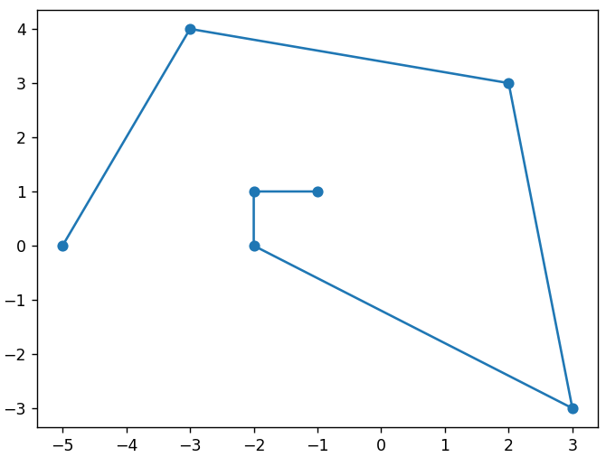

## About this project

This project contains module which allows to sort some points in flat XY spirally. This module is tested (there are at least 10 cases).

## Idea of the algorithm

At the start we pick pivot point that should be connected to a next point (at the start we take the most left point, in case there are two such points we take the most down one). After that algorithm consists of three major steps:

- Step 1: shifting points at the center of cartesian system

- Step 2: rotating points with the angle that is required to rotate our pivot point to the axis x

- Step 3: pick a next point with the biggest angle (atan2 is used to define angles)

After that we use the picked point as a new pivot point and repeat steps 1, 2, 3 without using connected points until unconnected points left.

## Mini-usage documentation
documentation in process...

## Covered tests
| № | Test title | Input | Output |
|---|----|-----|-----------|
| 1 | Simple square |  |  |
| 2 | Simple curve |  |  |
| 3 | Curve |  |  |
| 4 | Square |  |  |
| 5 | Horizontal line |  |  |
| 6 | Vertical line |  |  |
| 7 | Shifted points |  |  |
| 8 | Similar points on flat xy |  |  |
| 9 | Four-grouped points |  |  |
| 10 | Spiral in one area |  |  |

## Setup launching

First you should define virtual environment (base module venv of python is used), in the root directory of project run these commands in your terminal to create and activate virtual environment:

`python -m venv venv`

`.\venv\Scripts\activate`

After that run command to install required packages for this projects:

`pip install -r req.txt`

Then run `pip install -e .` in the root of project so you can setup "importing" paths between folders src and tests.

To run tests you should run this command in the root of project:

`pytest tests`
