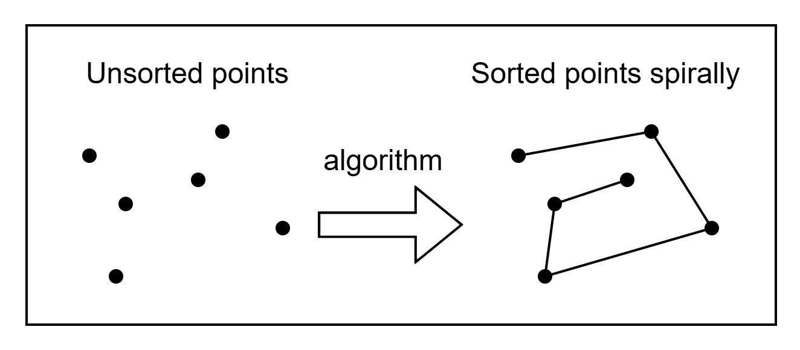

## About this project

This project contains the module which allows to sort some points in flat XY spirally. This module is tested (there are at least 10 cases).



## Idea of the algorithm

At the start we pick a pivot point that should be connected to a next point (we take the most left point along the axis x, in case there are two such points we take the lowest point along the axis y). After that the algorithm consists of three major steps:

- Step 1: shifting points at the center of cartesian system


- Step 2: rotating points with the angle that is required to rotate our pivot point to the axis x


- Step 3: picking a next point with the biggest angle (atan2 is used to define angles)


After that we use the picked point as a new pivot point and repeat the steps 1, 2, 3 without using connected points until unconnected points left.

## Covered tests
| № | Test title | Input | Output |
|---|----|-----|-----------|
| 1 | Simple square |  |  |
| 2 | Simple curve |  |  |
| 3 | Curve |  |  |
| 4 | Square |  |  |
| 5 | Horizontal line |  |  |
| 6 | Vertical line |  |  |
| 7 | Shifted points |  |  |
| 8 | Similar points on flat xy |  |  |
| 9 | Four-grouped points |  |  |
| 10 | Spiral in one area |  |  |

## Mini-usage documentation

This project contains the function `sort_points_spirally` in the src/main.py. There is the description of inputs, outputs and example for this function in this section.

### Inputs

`points: List[List[float]]` is the first argument of the function, it should be a list of points e.g. `[[-2, -2, 1], [-1.9, -1, 1]]`.

`showing_result: boolean` is the second argument of the function if it is `True` then the function will also show a result as a plot (a scattered plot of input `points` and then a plot of output as connections of ordered points). By default it is `False`.

### Outputs

`points_order: List[int]` is a list of indexes which show index of input `points`. For example, `[1, 0]` means that a first point is a point with index 1 of input `points` so to get this point you can access it by this index e.g. `points[1]`.

### Example
```
points = [[-2, -2, 1], [-1.9, -1, 1], [-1.5, 0, 1], [-1, 1, 0], [ 0, 1.2, 0], [1, 0.8, 0], [1.5, 0, 0], [1, -1, 0], [0, -0.7, 0], [0, 0, 0], [0.1, 0, 0]]

points_order = sort_points_spirally(points, True)
# result is [0, 1, 2, 3, 4, 5, 6, 7, 8, 9, 10] 
# it has True as a second arg so it also will show the result as a plot
```

## Setup launching

First you should define a virtual environment (basic module venv of python is used), in the root directory of the project run these commands in your terminal to create and activate the virtual environment:

`python -m venv venv`

`.\venv\Scripts\activate`

After that run the following command to install required packages for this projects:

`pip install -r req.txt`

Then run `pip install -e .` in the root of the project so you can setup the "importing" paths between the folders src and tests.

To run all tests you should run this command in the root of the project:

`pytest tests`
